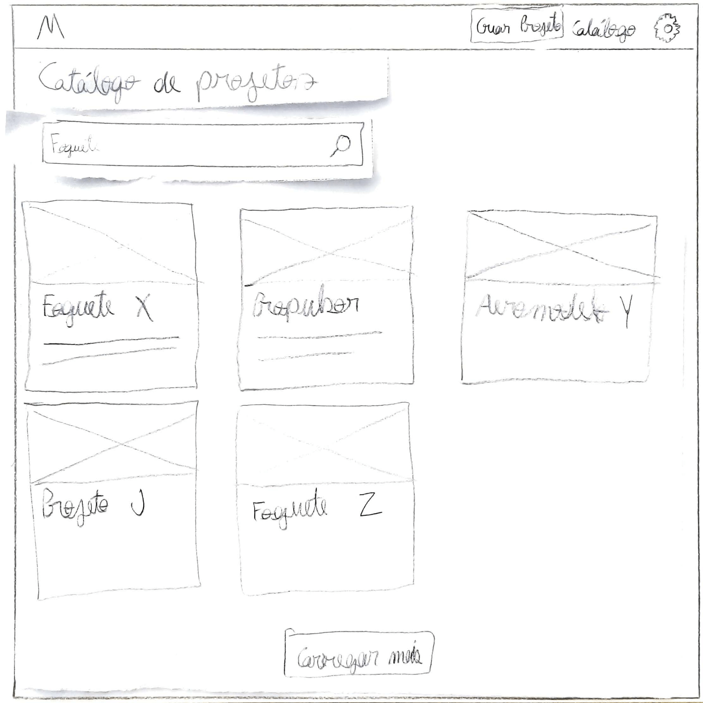
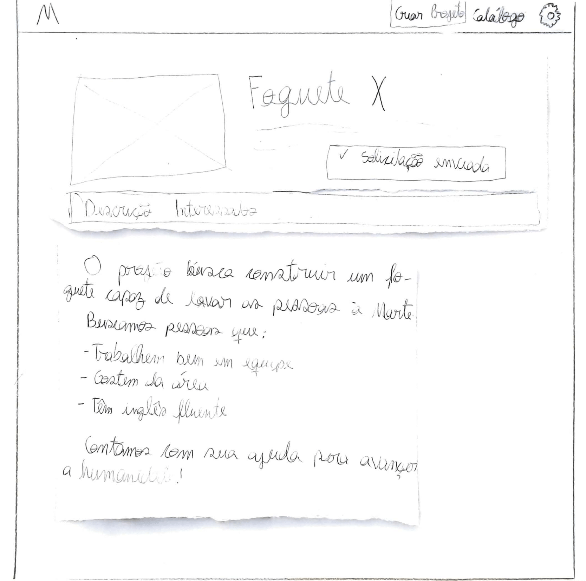

# Protótipo de Papel (Versão 1)

## Objetivos

- Fazer um julgamento de valor sobre a qualidade de uso da solução de IHC.

- Identificar problemas na interação e na interface que prejudiquem a experiência particular do usuário durante o uso do sistema.

## Resultados

<table class="versions">
	<tr>
		<th>Problema detectado</th>
		<th>Solução Proposta</th>
	</tr>
	<tr>
		<td>Dificuldade em acessar perfis de outros usuários.</td>
		<td>Ter a opção de acessar o perfil de outro usuário por meio de uma busca direta.</td>
	</tr>
	<tr>
		<td>Dificuldade em visualizar quais projetos são autorais e quais o usuário participa.</td>
		<td>Separar a área de projetos em projetos autorais e projetos em que o usuário participa.</td>
	</tr>
	<tr>
		<td>Dificuldade em saber do que se trata o projeto sem ter que ler uma grande descrição criada pelo autor do projeto.</td>
		<td>Filtrar projetos por temas e tornar a descrição que se encontra vê na busca algo mais específico.</td>
	</tr>
	<tr>
		<td>Dificuldade em acessar o perfil do usuário.</td>
		<td>Criar uma aba da conta do usuário, para o usuário ter acesso e poder editar seu perfil.</td>
	</tr>
	<tr>
		<td>Dificuldade em contatar com outro usuário</td>
		<td>Criar acesso que permita o usuário mandar mensagens para um usuário específico.</td>
	</tr>
	<tr>
		<td>Dificuldade em encontrar usuários que já tenho contato em comum por um projeto.</td>
		<td>Criar meio para que os usuários possam seguir uns aos outros.</td>
	</tr>
</table> 
 

## Imagens do Protótipo

# Protótipo de Papel alternativa (Versão 1)

