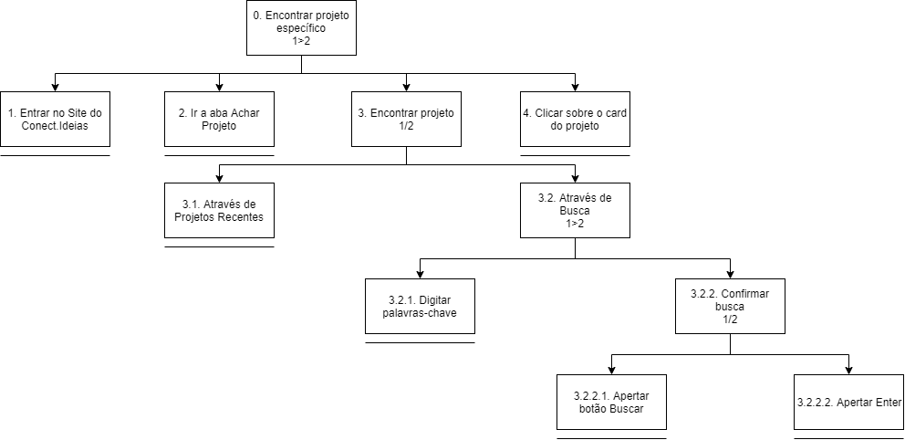
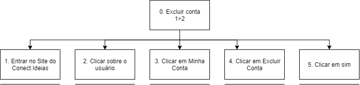

# Análise Hierárquica de Tarefas

 

&emsp;&emsp;A Análise Hierárquica de Tarefas, abreviada como AHT, foi desenvolvida na década de 1960, tendo como intuito inicial de identificar as necessidades de treinamento.
 
&emsp;&emsp;A ideia básica desta análise é relacionar o que as pessoas fazem - sendo essas as tarefas - com o por que elas fazem e as suas consequências, em caso de erros.  O ponto de partida desta análise são os objetivos do usuário, onde são identificadas as principais tarefas e subtarefas associadas à conclusão desse objetivo.
 
&emsp;&emsp;Será utilizada a representação AHT encontrada em Barbosa e Silva, 2010.

## Versões

<table class="versions">
	<tr>
		<th class="version_header">Versão</th>
		<th>Detalhes</th>
		<th>Data</th>
	</tr>
	<tr>
		<td>1.0</td>
		<td>Versão inicial: Criação de projeto, busca de projeto e registro</td>
		<td>05/11/2019</td>
	</tr>
	<tr>
		<td>1.1</td>
		<td>Adição de exclusão de conta e correção de versionamento</td>
		<td>05/11/2019</td>
	</tr>
</table>

## Registro

 

## Encontrar projeto específico

 

## Criar um novo projeto

## Exclusão de conta
