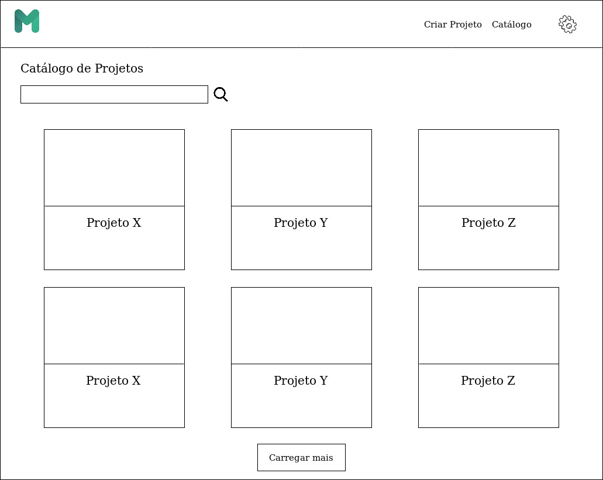
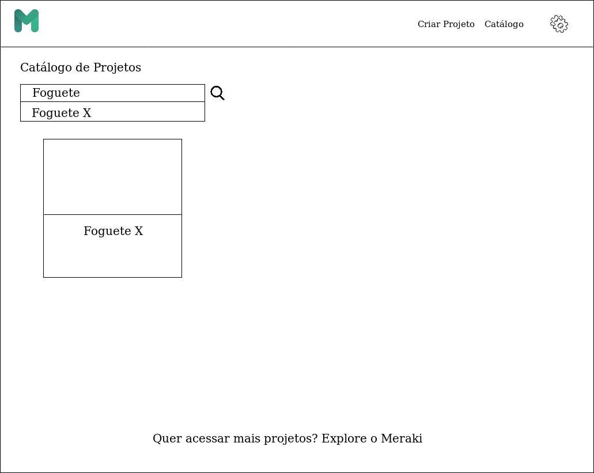
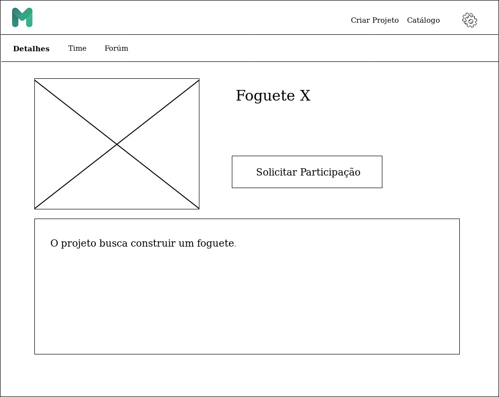
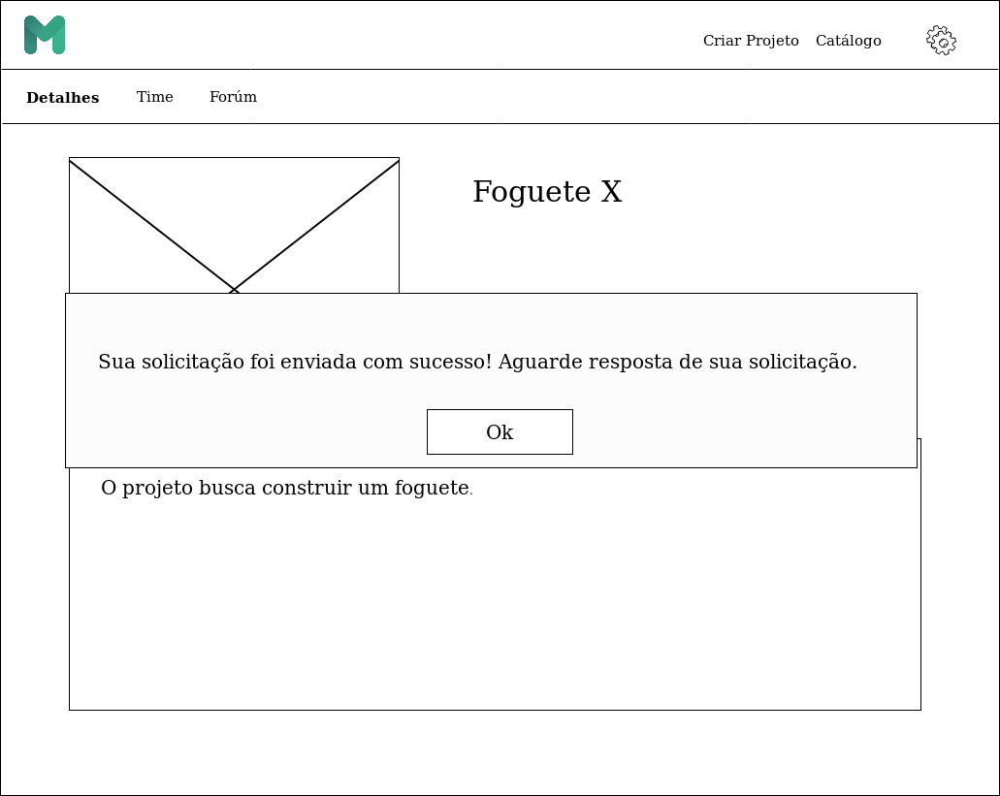
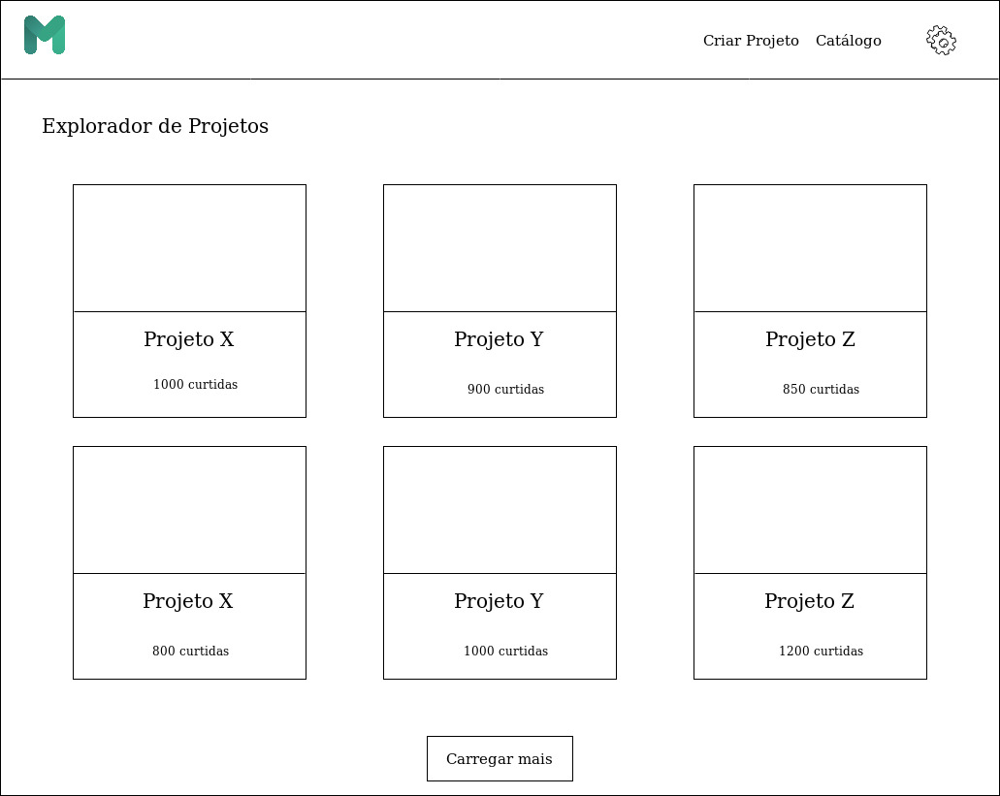
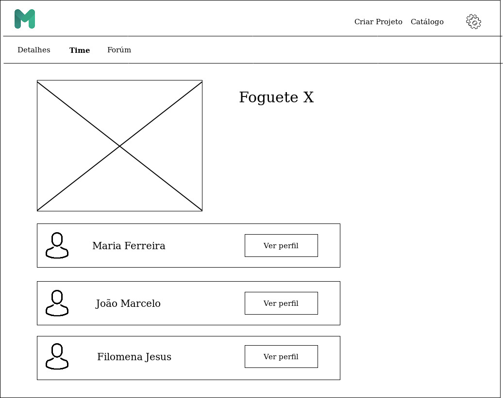

# Protótipo de Média Fidelidade (Versão 1)

## Versões

<table class="versions">
	<tr>
		<th class="version_header">Versão</th>
		<th>Detalhes</th>
		<th>Data</th>
	</tr>
	<tr>
		<td>1.0</td>
		<td>Criação do protótipo.</td>
		<td>04/11/2019</td>
	</tr>	
	<tr>
		<td>1.1</td>
		<td>Adição das respostas geradas pelo teste do usuário.</td>
		<td>05/11/2019</td>
	</tr>	
</table> 

## Participantes
- Micaella Gouveia
- Sofia Patrocínio

## Objetivos

A avaliação foi efetuada utilizando um protótipo de média fidelidade feito no Draw.io afim de corrigir os erros encotrados no Protótipo de Papel (Versão 2), e possivelmente encontrar novos erros para corrigi-los. As funcionalidades testadas foram a busca de projetos e a página de um projeto.
 
As tarefas requisitadas ao usuário foram:
 

- Buscar um projeto específico.
- Descobrir informações do projeto.
 - Descrição.
 - Pessoas que trabalham no projeto.
- Solicitar participação no projeto.

## Perguntas

1. O usuário consegue atingir os objetivos com sucesso?
2. Os padrões de interação utilizados são intuitivos?
3. Os títulos dos botões são intuitivos?

### Termo de consentimento

[Termo de consentimento livre e esclarecido](./termo_consentimento.md)

## Respostas

<table class="versions">
 <tr>
  <th>Pergunta</th>
  <th>Resposta</th>
        <th>Solução Proposta</th>
 </tr>
 <tr>
  <td>1</td>
  <td>Na maior parte sim. Ele agora consegue visualizar os participantes do projeto de uma forma mais intuitiva. O usuário questionou no caso de não encontrar um projeto, se não há projetos semelhantes(pelo nome ou tipo).</td>
        <td>Exibir projetos relacionados à pesquisa do usuário, independentemente se o que ele procurou foi encontrado com sucesso.</td>
 </tr>
 <tr>
  <td>2</td>
  <td>Na maior parte sim. O usuário conseguiu realizar a busca apertando na lupa, mas sentiu falta de um botão de retorno para a página anterior. </td>
        <td>Criar botões de retorno em todas as abas da aplicação.</td>
 </tr>
 <tr>
  <td>3</td>
  <td>Sim. O usuário conseguiu compreender cada aspecto da página do projeto. Os nomes "Detalhes", "Time" e "Fórum" foram auto-explicativos. O usuário sugeriu uma mudança no nome do botão "Carregar Mais" para algo mais intuitivo.</td>
        <td>Alterar o nome do botão "Carregar Mais" para algo como "Saber Mais", "Ver Mais", entre outros.</td>
 </tr>
</table> 
 

## Imagens do Protótipo

## Referências
- https://about.draw.io/use-draw-io-to-mockup-your-mobile-apps/

