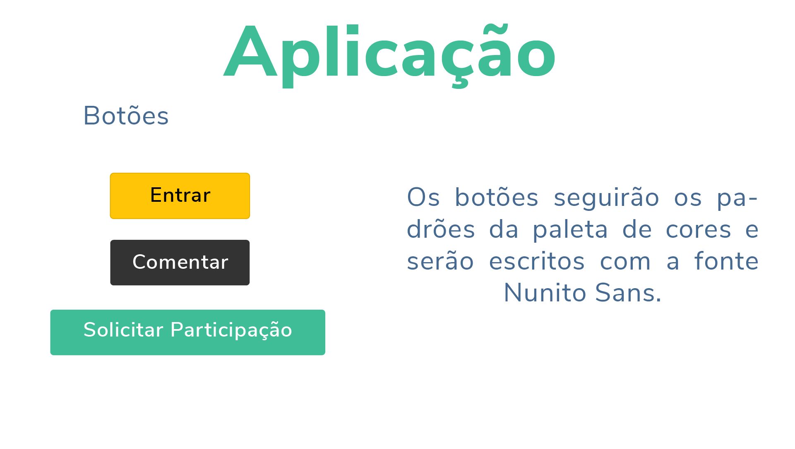
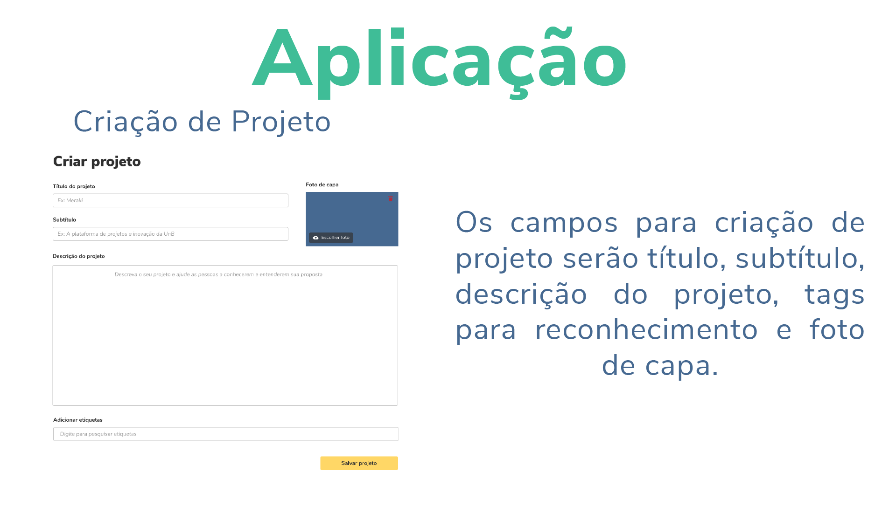

# Guia de Estilo

&emsp;&emsp;O guia de estilo define a comunicação verbal e visual da aplicação. Ele deve ser desenvolvido levando em consideração qual mensagem e características se quer passar aos usuários.

## Versões

<table class="versions">
	<tr>
		<th class="version_header">Versão</th>
		<th>Detalhes</th>
		<th>Data</th>
	</tr>
	<tr>
		<td>1.0</td>
		<td>Criação da nova logo.</td>
		<td>08/10/2019</td>
	</tr>	
	<tr>
		<td>1.1</td>
		<td>Criação da nova paleta de cores e tipografia.</td>
		<td>10/10/2019</td>
	</tr>
	<tr>
		<td>1.2</td>
		<td>Criação da aplicação.</td>
		<td>11/10/2019</td>
	</tr>		
	<tr>
		<td>1.2</td>
		<td>Adição do guia de estilo.</td>
		<td>14/10/2019</td>
	</tr>	
</table> 

&emsp;&emsp;A mudança do nome da aplicação tem como objetivo um nome fácil de lembrar e falar, mais curto, único e moderno. Com significado relevante para o contexto.

&emsp;&emsp;

&emsp;&emsp;

&emsp;&emsp;As cores da logo compreendem o verde, trazendo confiança e simbolizando crescimento, que acreditamos ser um dos objetivos da apliação. Projetos que tragam crescimento pessoal e profissional.

&emsp;&emsp;A paleta de cores abrange mais cores e mais vivas. As cores quentes traduzem ideias mais dinâmicas e agitadas, usada ade forma cuidadosa, na aplicação, pode levar mais interação com o usuário e engajamento.

&emsp;&emsp;Foram usadas fontes claras, legíveis e facéis de serem lidas.

&emsp;&emsp;

&emsp;&emsp;

&emsp;&emsp;

