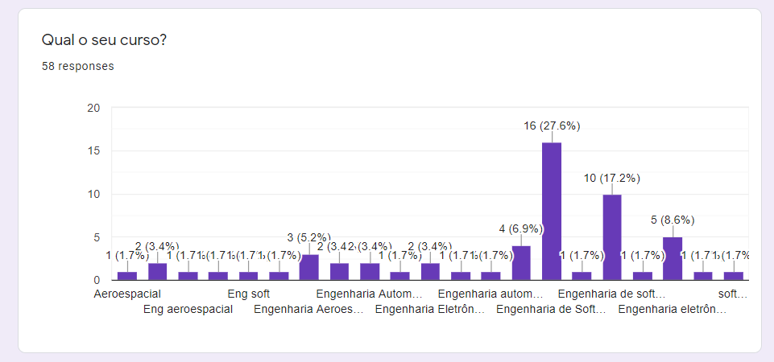
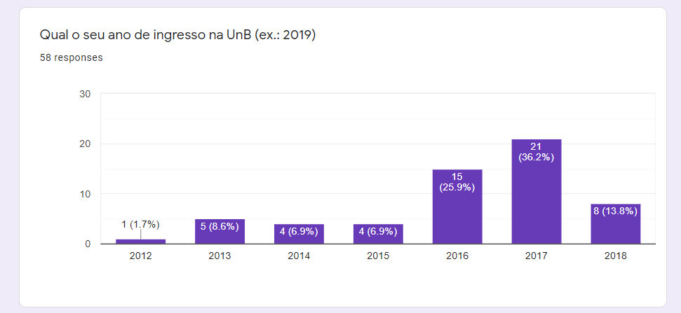
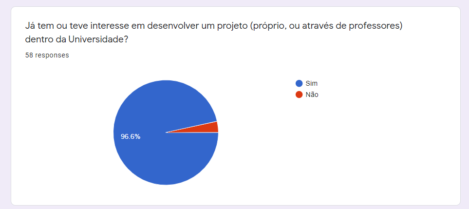
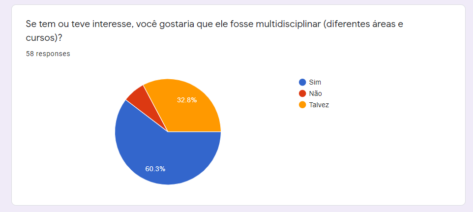
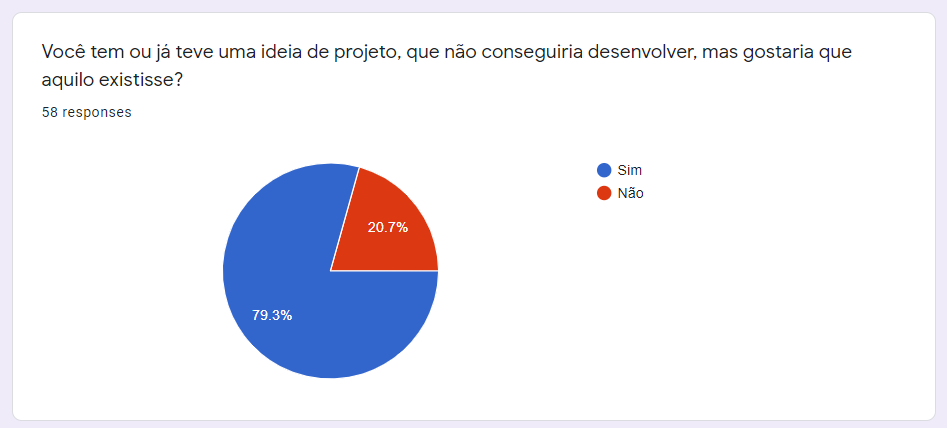
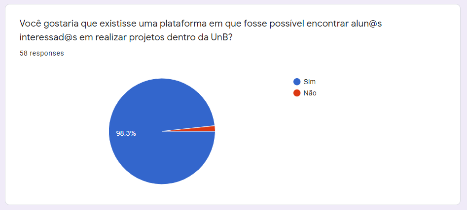
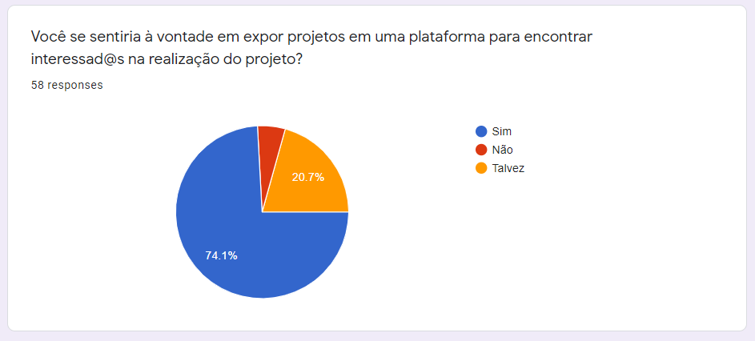
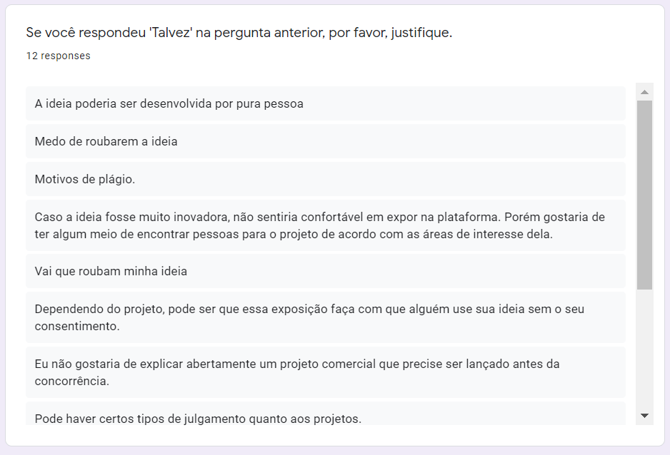

# Questionário

&emsp;
Realizamos um questionário afim de coletar informações sobre nosso público alvo e o interesse deles em utilizar a plataforma.
 

## Versões

<table class="versions">
	<tr>
		<th class="version_header">Versão</th>
		<th>Detalhes</th>
		<th>Data</th>
	</tr>
	<tr>
		<td>1.0</td>
		<td>Abertura do questionário para o público.</td>
		<td>01/10/2019</td>
	</tr>	
	<tr>
		<td>1.1</td>
		<td>Adição do questionário e seus resultados.</td>
		<td>14/10/2019</td>
	</tr>	
</table> 

## Participantes
- Micaella Gouveia
- Sofia Patrocínio
- Eduardo Lima
- Luís Henrique
- Samuel Pereira
- Kaique Borges

## Resultados

 
Analisamos que nosso público alvo em sua maioria cursa Engenharia de Software.
 

 
Em relação ao ano de ingresso, podemos analisar que em sua maioria os alunos ingressaram entre 2016 e 2017.
 

 
A grande maioria dos estudantes possuem o interesse em desenvolver projetos dentro da universidade.
 

 
Dentre os alunos que possuem esse interesse, a grande maioria desejaria participar de projetos multidisciplinares.
 

 
Em relação ao resultados, podemos perceber que a maioria dos estudantes já tiveram ou têm alguma ideia de projeto que deseja desenvolver.
 

 
Analisamos que nosso público, quase unânime, gostaria de uma plataforma voltada para projetos na UnB.
 

 
Analisamos que nosso público, em sua maioria, não teria problemas em expor projetos em uma plataforma específica. 
 

 
Podemos notar que as pessoas que responderam "Talvez" na pergunta anterior, alegaram como principal obstáculo o risco de plágio de seus projetos ou ideias.
 

