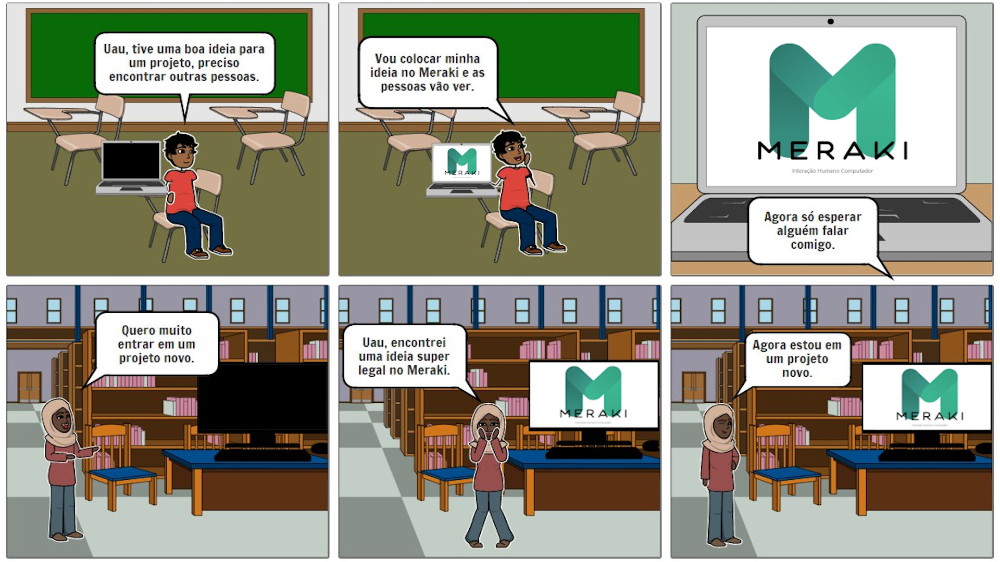

# Storyboard

<table class="versions">
	<tr>
		<th class="version_header">Versão</th>
		<th>Detalhes</th>
		<th>Data</th>
	</tr>
	<tr>
		<td>1.0</td>
		<td>Adição do <a href="../assets/storyboard/storyboard1.png">storyboard</a>.</td>
		<td>7/9/2019</td>
  </tr>
  <tr>
		<td>1.1</td>
		<td>Adição do storyboard com nome atualizado.</td>
		<td>16/10/2019</td>
	</tr>
	<tr>
		<td>1.2</td>
		<td>Adição de tabela de diferentes versões do storyboard.</td>
		<td>16/10/2019</td>
	</tr>
	<tr>
		<td>1.3</td>
		<td>Remoção da versão antiga do storyboard da página principal e adição do link na tabela de versionamento.</td>
		<td>18/11/2019</td>
	</tr>
</table> 

### Participantes
- Luís Henrique
 
 

