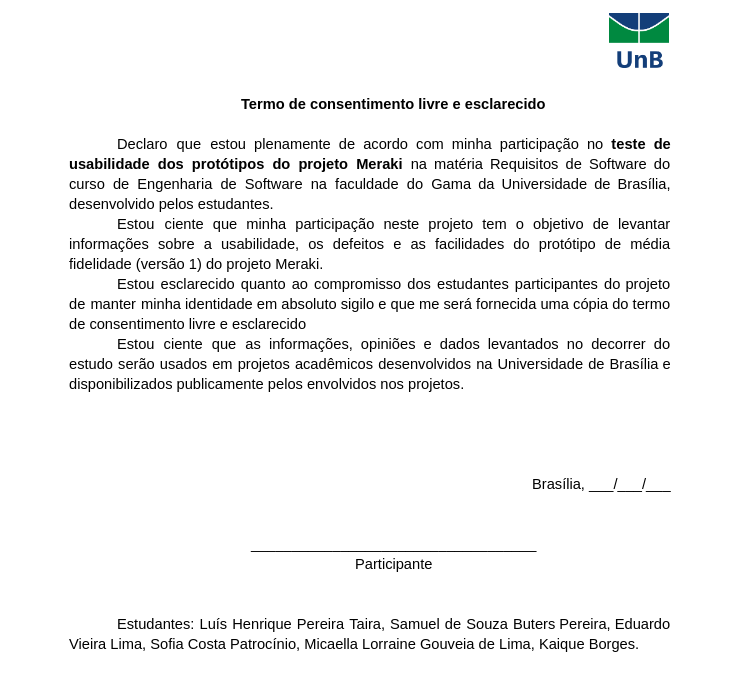

# Termo de consentimento livre e esclarecido

<table class="versions">
	<tr>
		<th class="version_header">Versão</th>
		<th>Detalhes</th>
		<th>Data</th>
	</tr>
  	<tr>
		<td>1.1</td>
		<td>Adição do <a href="../assets/consentimento/termo_antigo.png">termo de consentimento</a>.</td>
		<td>13/11/2019</td>
	</tr>
	<tr>
		<td>1.2</td>
		<td>Adição de referências.</td>
		<td>16/11/2019</td>
	</tr>
	<tr>
		<td>1.3</td>
		<td>Inclusão de todos os protótipos no termo de consentimento.</td>
		<td>24/11/2019</td>
	</tr>
</table> 
 

### Participantes
- Luís Henrique

## Referências 

&emsp;&emsp;Universidade de Araquara, Comitê de ética em pesquiesa. Modelo do TCLE. Disponível em: <a href=https://www.uniara.com.br/arquivos/file/comite-de-etica/termos-obrigatorios/termo-consentimento-TCLE-20180813.doc>https://www.uniara.com.br/arquivos/file/comite-de-etica/termos-obrigatorios/termo-consentimento-TCLE-20180813.doc</a>. Acesso em: 13 nov. 2019.

&emsp;&emsp;Resolução Nº 466/12, Roteiro sugerido. Disponível em: <a href=https://www.uniara.com.br/arquivos/file/comite-de-etica/termos-obrigatorios/roteiro-resolucao-466-12.pdf>https://www.uniara.com.br/arquivos/file/comite-de-etica/termos-obrigatorios/roteiro-resolucao-466-12.pdf</a>. Acesso em: 13 nov. 2019.

&emsp;&emsp;SALES, André B.; SALES, Márcia B.; BOSCARIOLI, Clodis. Termo de Consentimento Livre Esclarecido, 2019. Disponível para participantes da Pesquisa de Opinião sobre Uso de Tecnologias Sociais.
