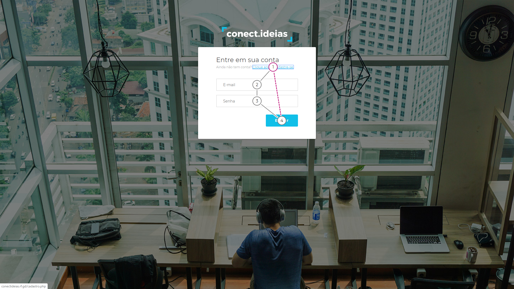
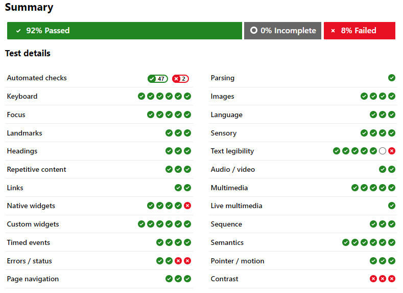

# WCAG

&emsp;&emsp;A WCAG, conhecida como as Diretrizes de Acessibilidade para Conteúdo Web, abrangem diversas diretrizes que visam tornar o conteúdo da Web mais acessível.  O seguimento dessas diretrizes resulta numa acessibilidade que atende uma grande extensão de pessoas com deficiências, como cegueira, surdez, limitações cognitivas e entre outros, como também combinações dessas deficiências.
 
&emsp;&emsp;A análise e utilização dessas diretrizes em relação ao Meraki permitirá a detecção de diversos problemas de acessibilidade como também as correções dos mesmos.
 
&emsp;&emsp;Será utilizada a ferramenta <a href="https://accessibilityinsights.io/docs/en/web/overview">Accessiblity Insights</a> para auxiliar a identificação de problemas com a WCAG 2.1.

## Versões

<table class="versions">
	<tr>
		<th class="version_header">Versão</th>
		<th>Detalhes</th>
		<th>Data</th>
	</tr>
	<tr>
		<td>1.0</td>
		<td>Versão inicial: Introdução e Tab Stops</td>
		<td>23/11/2019</td>
	</tr>
	<tr>
		<td>1.1</td>
		<td>Adição de Tab Stop e avaliação geral da página de Login e Cadastro, e referências</td>
		<td>24/11/2019</td>
	</tr>
</table>

## Participantes
- Samuel Pereira

## Tab Stops

&emsp;&emsp;O Tab Stops é um teste a partir da ferramenta Accessiblity Insights que permite a identificação de conformidades de acordo com algumas diretrizes, sendo elas: 2.1 Teclado; 3.2.3 Navegação Consistente; 3.2.4 Identificação Consistente.
 
&emsp;&emsp;Segue abaixo imagens dos testes realizados e seus resultados:

	
	
	
	
	
	
	

 

### Resultados
| Diretriz | Descrição das ocorrências |
|-|-|
| 2.1.1 Teclado| O menu de usuário não é acessível em nenhuma página através do teclado. A opção excluir conta também não é acessível. |

## Avaliação Geral

&emsp;&emsp;A avaliação geral será feita usando a ferramenta de Assessment do Accessiblity Insights que permite verificar as diversas diretrizes da WCAG através de testes guiados, sendo alguns deles automáticos, assistidos ou manuais.

### Página de Login e Cadastro

&emsp;&emsp;As páginas de Login e Cadastro possuem uma estrutura diferente do resto do site, tendo assim de ter todos os testes feitos em exclusividade para essas seções.
 
&emsp;&emsp;Segue abaixo o relatório do teste realizado e os resultados referentes ao mesmo:

### Resultados
| Diretriz | Descrição das ocorrências |
|-|-|
| 1.4.3 Contraste| O contraste de cores no site, principalmente as cores azuis claras, não tem uma proporção suficiente para atender a diretriz. |
| 1.3.1 Informações e Relações | Elemento Form não possui label. |
| 3.3.2 Rótulos ou Instruções | Elemento Form não possui label. |
| 3.3.2 Rótulos ou Instruções | Element Form não possui label que identifique o seu input. |
| 3.3.1 Identificação do Erro | Não há atributo aria identificando o erro do login e o aviso aparece no topo da página. |
| 4.1.3 Mensagem de Status | Não há utilização de role para a mensagem de erro. |
| 1.4.10 Refluxo | É preciso realizar scroll em duas dimensões para que o conteúdo textual seja visível. |
| 1.4.11 Contraste não-textual | Botões azuis e links presente no site não possuem contraste o suficiente. A mudança de estado do link quando o mouse está em cima do mesmo também não possui contraste suficiente. |
| 1.4.11 Contraste não-textual | Cores azul do logotipo não possuem contraste suficiente com o fundo. |

## Referências

&emsp;&emsp;KIRKPATRICK, Andrew; CONNOR, Joshue o; CAMPBELL, Alastair; COOPER, Michael. Web Content Accessibility Guidelines (WCAG) 2.1. W3C, 2018. Disponível em : <[https://www.w3.org/TR/2018/REC-WCAG21-20180605/](https://www.w3.org/TR/2018/REC-WCAG21-20180605/)>. Acesso em: 24 nov. 2019.

