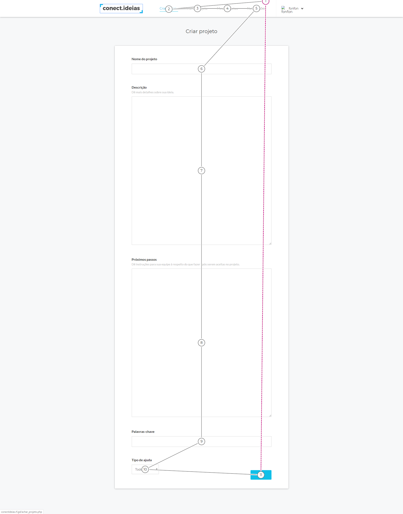
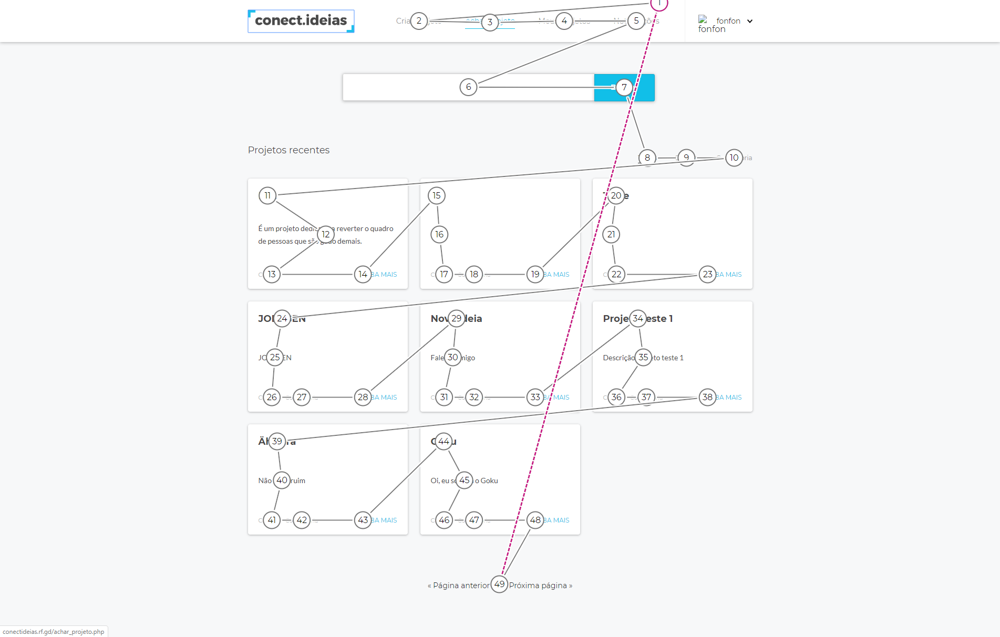
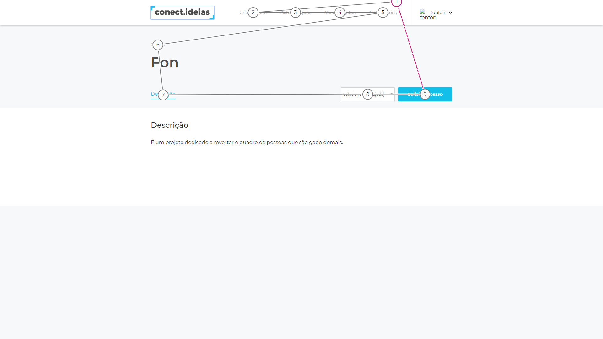
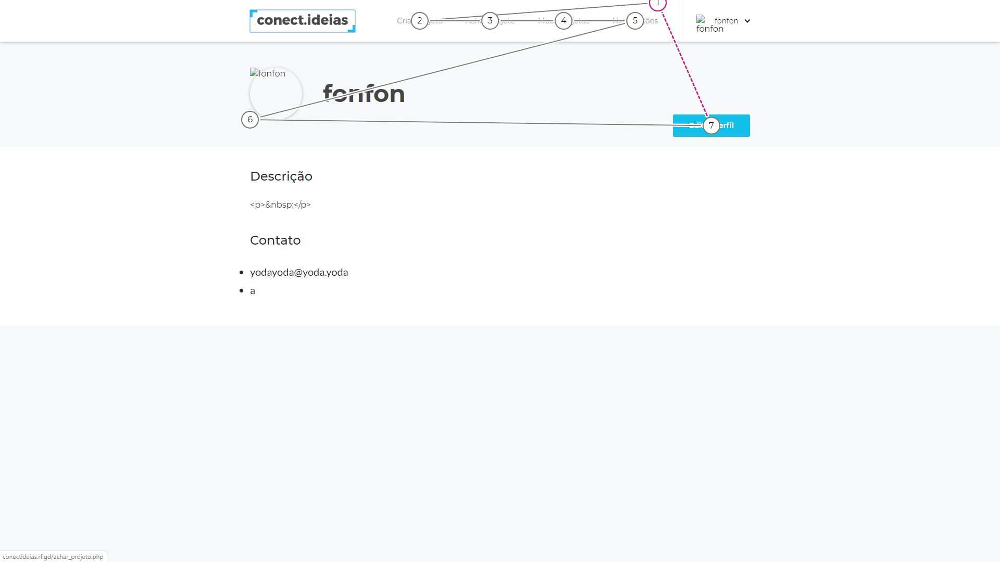
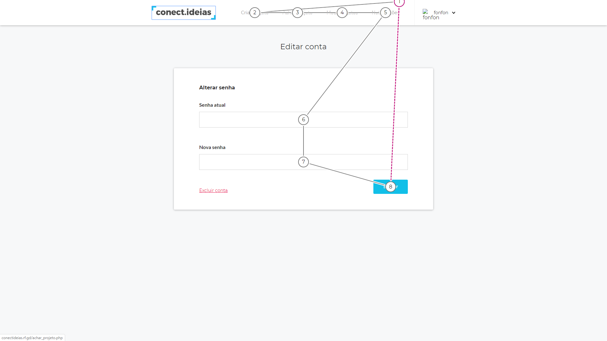
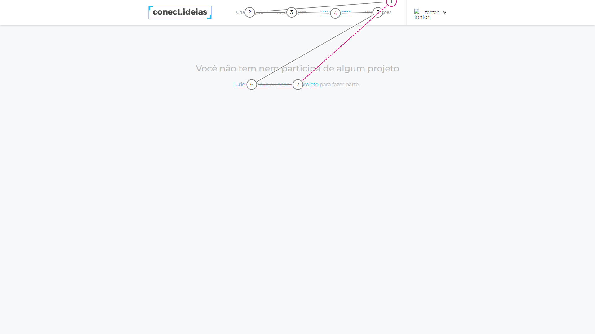

# WCAG

&emsp;&emsp;A WCAG, conhecida como as Diretrizes de Acessibilidade para Conteúdo Web, abrangem diversas diretrizes que visam tornar o conteúdo da Web mais acessível.  O seguimento dessas diretrizes resulta numa acessibilidade que atende uma grande extensão de pessoas com deficiências, como cegueira, surdez, limitações cognitivas e entre outros, como também combinações dessas deficiências.
 
&emsp;&emsp;A análise e utilização dessas diretrizes em relação ao Meraki permitirá a detecção de diversos problemas de acessibilidade como também as correções dos mesmos.
 
&emsp;&emsp;Será utilizada a ferramenta <a href="https://accessibilityinsights.io/docs/en/web/overview">Accessiblity Insights</a> para auxiliar a identificação de problemas com a WCAG.

## Versões

<table class="versions">
	<tr>
		<th class="version_header">Versão</th>
		<th>Detalhes</th>
		<th>Data</th>
	</tr>
  <tr>
		<td>1.0</td>
		<td>Versão inicial: Introdução e Tab Stops</td>
		<td>23/11/2019</td>
	</tr>
</table>

## Participantes
- Samuel Pereira

## Tab Stops

&emsp;&emsp;O Tab Stops é um teste a partir da ferramenta Accessiblity Insights que permite a identificação de conformidades de acordo com algumas diretrizes, sendo elas: 2.1 Teclado; 3.2.3 Navegação Consistente; 3.2.4 Identificação Consistente.
 
&emsp;&emsp;Segue abaixo imagens dos testes realizados e seus resultados:

	
	
	
	
	
	

 

### Resultados
| Diretriz | Descrição das ocorrências |
|-|-|
| 2.1.1 Teclado| O menu de usuário não é acessível em nenhuma página através do teclado. A opção excluir conta também não é acessível. |